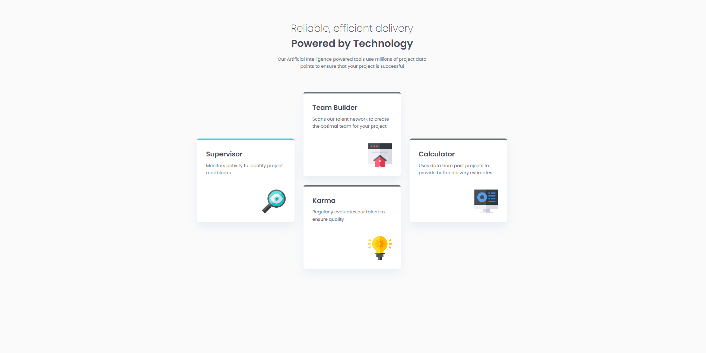

# 💠 Four Card Feature Section

This is a solution to the Four Card Feature design challenge. It showcases a responsive, grid-based layout that shifts gracefully from a single-column mobile stack to a complex multi-axis desktop grid.

## 🔗 Links

- **Live Site URL:** https://ahmad7000mahadi.github.io/four-card-feature-section/
- **GitHub Repo URL:** https://github.com/ahmad7000mahadi/four-card-feature

## 📖 Overview

### The Challenge

Users should be able to:

- View the optimal layout for the site depending on their device's screen size.
- See hover states for all interactive elements on the page.
- Distinguish between features via specific color-coded borders.

### Screenshot




## ✨ Features

- **Advanced CSS Grid Layout:** Utilizes a 3-column grid with specific row spanning (`grid-row: span 2`) to achieve the vertically centered "cross" layout on desktop.
- **Fluid Typography:** Implements `clamp()` functions for font sizing, ensuring text scales smoothly between viewports without disjointed jumps.
- **Mobile-First Architecture:** Styles are written for mobile devices first, with progressive enhancement for larger screens using `em`based media queries.
- **Semantic HTML5:** Uses proper `<main>`, `<header>`, and `<section>` tags to ensure accessibility and SEO optimization.
- **BEM Naming Convention:** Follows Block-Element-Modifier methodologies (e.g., `.card--cyan`) for scalable and maintainable CSS.

## 🛠️ Tech Stack

- **Markup:** Semantic HTML5
- **Styling:** CSS3 (Custom Properties)
- **Layout:** Flexbox (Mobile) & CSS Grid (Desktop)
- **Fonts:** Google Fonts (Poppins)

## 🏗️ Project Structure & Architecture

### The "Diamond" Grid Strategy

The core technical challenge was aligning the cards on the desktop view. Instead of using complex margins or absolute positioning, we utilized CSS Grid:

```css
.features-grid {
  grid-template-columns: repeat(3, 1fr);
  grid-template-rows: repeat(2, 1fr);
  align-items: center; /* Vertically centers the side cards */
}

```

### Accessible Colors

We separated the color logic from the structural logic using BEM modifiers. This allows the layout code to remain clean while managing themes independently.

## 🎨 Design Tokens

| Token Name | Value | Color/Use |
| --- | --- | --- |
| `--color-primary-red` | `hsl(0, 78%, 62%)` | Team Builder (Border) |
| `--color-primary-cyan` | `hsl(180, 62%, 55%)` | Supervisor (Border) |
| `--color-primary-orange` | `hsl(34, 97%, 64%)` | Karma (Border) |
| `--color-primary-blue` | `hsl(212, 86%, 64%)` | Calculator (Border) |
| `--color-neutral-dark` | `hsl(234, 12%, 34%)` | Headings |
| `--color-neutral-gray` | `hsl(212, 6%, 44%)` | Body Text |

## ✍️ Author

- **Name:** [Adi]
- **Frontend Mentor:** [ahmadmahadi](https://www.frontendmentor.io/profile/ahmad7000mahadi)